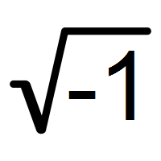

# Algorithm

## Characteristics of an Algorithm

* **Input** - 0 or more
* **Output** - at least 1 output
* **Definiteness** -
* **Fineness**  
* **Effectiveness** 

## How to write an Algorithm

```cpp
Algorithm swap(a, b)
{
    temp = a;
    a = b;
    b = temp;
}
```


