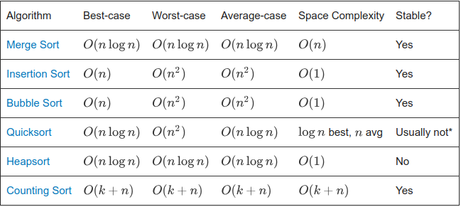

# Sorting Algorithms

A **sorting algorithm** is an algorithm made up of a series of instructions that takes an [array](https://brilliant.org/wiki/arrays/) as input, performs specified operations on the array, sometimes called a list, and outputs a sorted array. Sorting algorithms are often taught early in computer science classes as they provide a straightforward way to introduce other key computer science topics like [Big-O notation](https://brilliant.org/wiki/big-o-notation/), [divide-and-conquer](https://brilliant.org/wiki/divide-and-conquer/) methods, and data structures such as [binary trees](https://brilliant.org/wiki/binary-search-trees/), and [heaps](https://brilliant.org/wiki/binary-heap/). There are many factors to consider when [choosing a sorting algorithm](https://brilliant.org/wiki/sorting-algorithms/#choosing-a-sorting-algorithm) to use.

## Sorting Algorithms

In other words, a sorted array is an array that is in a particular order. For example,  is sorted alphabetically,  is a list of integers sorted in increasing order, and  is a list of integers sorted in decreasing order.

A sorting algorithm takes an array as input and outputs a [permutation](https://brilliant.org/wiki/permutations/) of that array that is sorted.

There are two broad types of sorting algorithms: **integer sorts** and **comparison sorts**.

## **Comparison Sorts**

Comparison sorts compare elements at each step of the algorithm to determine if one element should be to the left or right of another element.

Comparison sorts are usually more straightforward to implement than integer sorts, but comparison sorts are limited by a lower bound of , meaning that, on average, comparison sorts cannot be faster than . A lower bound for an algorithm is the _worst-case_running time of the _best_ possible algorithm for a given problem. The "on average" part here is important: there are many algorithms that run in very fast time if the inputted list is _already_ sorted, or has some very particular \(and overall unlikely\) property. There is only one permutation of a list that is sorted, but  possible lists, so the chances that the input is already sorted is very unlikely, and on average, the list will not be very sorted.

> **The running time of comparison-based sorting algorithms is bounded by .**
>
> A comparison sort can be modeled as a large [binary tree](https://brilliant.org/wiki/binary-search-trees/) called a decision tree where each node represents a single comparison. Because the sorted list is some permutation of the input list, for an input list of length , there are  possible permutations of that list. This is a decision tree because each of the  is represented by a leaf, and the path the algorithm must take to get to each leaf is the series of comparisons and outcomes that yield that particular ordering.
>
> At each level of the tree, a comparison is made. Comparisons happen, and we keep traveling down the tree; until the algorithm reaches the leaves of the tree, there will be a leaf for each permutation, so there are  leaves.
>
> Each comparison halves the number of future comparisons the algorithm must do \(since if the algorithm selects the right edge out of a node at a given step, it will not search the nodes and paths connected to the left edge\). Therefore, the algorithm performs comparisons. Any binary tree, with height , has a number of leaves that is less than or equal to .
>
> From this,Taking the [logarithm](https://brilliant.org/wiki/logarithms/) results inFrom [Stirling's approximation](https://brilliant.org/wiki/stirlings-formula/), Therefore,

## **Integer Sorts**

Integer sorts are sometimes called counting sorts \(though there is a specific integer sort algorithm called counting sort\). Integer sorts do not make comparisons, so they are not bounded by . Integer sorts determine for each element​  how many elements are less than . If there are  elements that are less than , then  will be placed in the  slot. This information is used to place each element into the correct slot immediately—no need to rearrange lists.

## Properties of Sorting Algorithms

All sorting algorithms share the goal of outputting a sorted list, but the way that each algorithm goes about this task can vary. When working with any kind of algorithm, it is important to know how fast it runs and in how much space it operates—in other words, its [time complexity](https://brilliant.org/wiki/time-complexity/) and [space complexity](https://brilliant.org/wiki/space-complexity/). As shown in the section above, comparison-based sorting algorithms have a time complexity of , meaning the algorithm can't be faster than . However, usually, the running time of algorithms is discussed​ in terms of big O, and not Omega. For example, if an algorithm had a worst-case running time of , then it is guaranteed that the algorithm will never be slower than , and if an algorithm has an average-case running time of , then on average, it will not be slower than .

The running time describes how many operations an algorithm must carry out before it completes. The space complexity describes how much space must be allocated to run a particular algorithm. For example, if an algorithm takes in a list of size , and for some reason makes a new list of size  for each element in , the algorithm needs  space.

Find the big-O running time of a sorting program that does the following:

* It takes in a list of integers.
* It iterates once through the list to find the largest element, and moves that element to the end.
* It repeatedly finds the largest element in the unsorted portion by iterating once through, and moves that element to the end of the unsorted portion.

At the end, the list is sorted low to high.

\(Also, try implementing this program in your language of choice.\)

Additionally, for sorting algorithms, it is sometimes useful to know if a sorting algorithm is stable.

> **Stability**
>
> A sorting algorithm is stable if it preserves the original order of elements with equal key values \(where the key is the value the algorithm sorts by\). For example,
>
> 
>
> When the cards are sorted by value with a stable sort, the two 5s must remain in the same order in the sorted output that they were originally in. When they are sorted with a non-stable sort, the 5s may end up in the opposite order in the sorted output.

## Common Sorting Algorithms

There are many different sorting algorithms, with various pros and cons. Here are a few examples of common sorting algorithms.

## [**Merge Sort**](https://brilliant.org/wiki/merge)

Mergesort is a comparison-based algorithm that focuses on how to merge together two pre-sorted arrays such that the resulting array is also sorted.

## [**Insertion Sort**](https://brilliant.org/wiki/insertion/)

Insertion sort is a comparison-based algorithm that builds a final sorted array one element at a time. It iterates through an input array and removes one element per iteration, finds the place the element belongs in the array, and then places it there.

## [**Bubble Sort**](https://brilliant.org/wiki/bubble-sort/)

Bubble sort is a comparison​-based algorithm that compares each pair of elements in an array and swaps them if they are out of order until the entire array is sorted. For each element in the list, the algorithm compares every pair of elements.

## [**Quicksort**](https://brilliant.org/wiki/quick-sort/)

Quicksort is a comparison-based algorithm that uses divide-and-conquer to sort an array. The algorithm picks a pivot element, , and then rearranges the array into two subarrays , such that all elements are less than , and , such that all elements are greater than or equal to .

## [**Heapsort**](https://brilliant.org/wiki/heap-sort/)

Heapsort is a comparison-based algorithm that uses a binary heap data structure to sort elements. It divides its input into a sorted and an unsorted region, and it iteratively shrinks the unsorted region by extracting the largest element and moving that to the sorted region.

## [**Counting Sort**](https://brilliant.org/wiki/counting-sort/)

Counting sort is an integer sorting algorithm that assumes that each of the  input elements in a list has a key value ranging from  to , for some integer . For each element in the list, counting sort determines the number of elements that are less than it. Counting sort can use this information to place the element directly into the correct slot of the output array.

## Choosing a Sorting Algorithm

To choose a sorting algorithm for a particular problem, consider the running time, space complexity, and the expected format of the input list.

\*Most quicksort implementations are not stable, though stable implementations do exist.

When choosing a sorting algorithm to use, weigh these factors. For example, quicksort is a very fast algorithm but can be pretty tricky to implement; bubble sort is a slow algorithm but is very easy to implement. To sort small sets of data, bubble sort may be a better option since it can be implemented quickly, but for larger datasets, the speedup from quicksort might be worth the trouble implementing the algorithm.

## See Also

* [Quick Sort](https://brilliant.org/wiki/quick-sort/)
* [Insertion Sort](https://brilliant.org/wiki/insertion/)
* [Radix Sort](https://brilliant.org/wiki/radix-sort/)
* [Heap Sort](https://brilliant.org/wiki/heap-sort/)
* [Bubble Sort](https://brilliant.org/wiki/bubble-sort/)
* [Merge Sort](https://brilliant.org/wiki/merge/)
* [Counting Sort](https://brilliant.org/wiki/counting-sort/)

