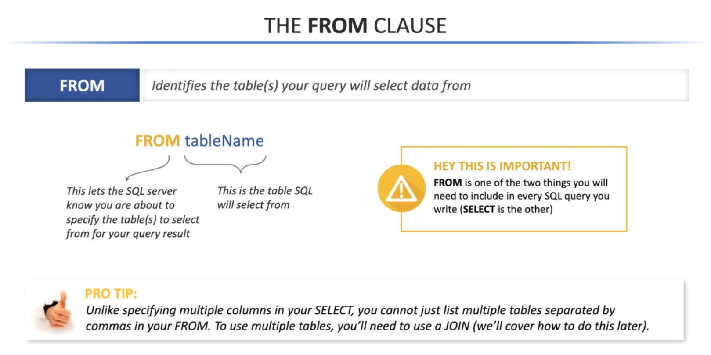

# MySQL

## Calling Database

```sql
USE dataBaseName;
```

## SELECT

> **SELECT** - Identifies the **column\(s\)** you want your query to select for your results.


```sql
# Syntax
SELECT columnName
```

```sql
# Examples

# Return one or more specific columns in results by naming them
# Seperate column names with a comma
SELECT
    customer_id,
    rental_date
FROM rental;
```

## FROM

> **FROM** - Identifies the **table\(s\)** your query will pull data from.  
> Comes **after** **SELECT**.



```sql
# Syntax
SELECT columnName 
FROM tableName
```

```sql
# Examples of SELECT and FROM

# Selects ALL columns from the specified table
# Without using a WHERE clause will return the entire table (all columns, all rows)
SELECT * 
FROM tableName
```

> **TIP** - `SELECT * FROM tableName`is a great way to quickly see what data a table contains.

## WHERE

> **WHERE** - _\(Optional\)_ Specifies filtering criteria to limit the amount of results that come out in your dataset.  
> Comes **after** **FROM**.

```sql
# Syntax
SELECT columnName 
FROM tableName 
WHERE logicalCondition
```

## GROUP BY

> **GROUP BY** - _\(Optional\)_ Specifies how to group the data in your results. Allows you to segment the data and do aggregate level analysis.  
> Comes **after** **WHERE**.

```sql
# Syntax
SELECT columnName 
FROM tableName 
WHERE logicalCondition 
GROUP BY columnName
```

## HAVING

> **HAVING** - _\(Optional\)_ Specifies group-filtering criteria for filtering specific groups based on certain criteria.   
>  Comes after **GROUP BY** and can only be used when **GROUP BY** is present.

```sql
# Syntax
SELECT columnName 
FROM tableName 
WHERE logicalCondition 
GROUP BY columnName 
HAVING logicalCondition
```

## ORDER BY

> **ORDER BY** - \(Optional\) Specifies the order \(sorting records\) in which your query results are displayed.   
> Comes **last** in query.

```sql
# Syntax
SELECT columnName 
FROM tableName 
WHERE logicalCondition 
GROUP BY columnName 
HAVING logicalCondition 
ORDER BY columnName
```

