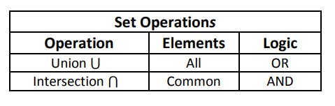
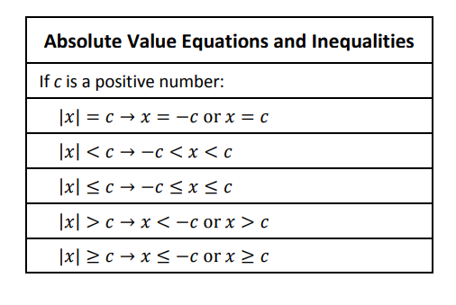

# Cheat Sheet

## Set Notation \(Interval / Set-Builder Notation\)

## Set Operations

## Coordinate Plane Quadrants

## Distance and Midpoint Formulas

## Intercepts of an Equation

## Symmetry of the Graph of an Equation

## Function Notation y = f\(x\)

## Function Arithmetic

## Transformations of Graphs of Functions

## Properties of Equality

## Properties of Inequalities

## Lines or Linear Functions

## Average Rate of Change

## Absolute Value Properties

## Absolute Value Function as a Piecewise-Defined Function

## Absolute Value Equations and Inequalities

## Parabolas or Quadratic Functions

## Special Factoring Formulas

## Special Product Formulas

## Quadratic Formula

## End Behavior of a Polynomial Function $$f(x)=ax^n+...$$ 

## Multiplicities of Real Zeros of a Polynomial Function $$f(x)=(x-a)^m$$ 

## Rational Functions

## Composition of Functions

## Inverse Function

## Radical Properties

## Exponent Laws and Properties

## Logarithm Definition

## Special Logarithms

## Logarithm Properties

## Laws of Logarithms

## Logarithm Change of Base Formula

## Steps to Solve an Exponential Equation

## Steps to Solve a Logarithmic Equation

## Arithmetic Sequence

## Geometric Sequence

## Finance Formulas

## Simple Interest

## Compound Interest

## Continuously Compounded Interest

## Future Value of an Annuity

## Present Value of an Annuity

## Payment Amount of a Loan

