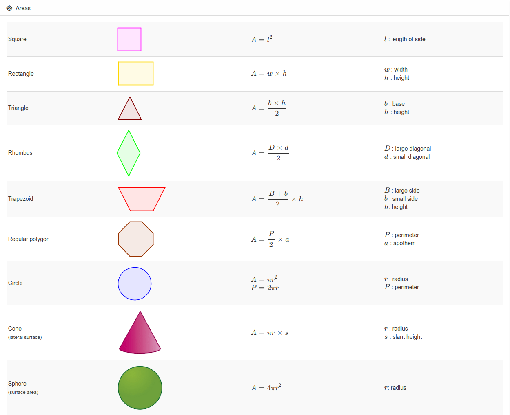
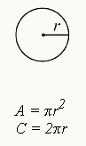

# Areas

## Area of a Circle

$$ A=πr^2$$ 

* π is a constant that can, for the purposes of the SAT, be written as 3.14 \(or 3.14159\)
* _r_ is the radius of the circle \(any line drawn from the center point straight to the edge of the circle\)

## Circumference of a Circle

#### $$C=2πr (or  C=πd)$$ 

* _d_ is the diameter of the circle. It is a line that bisects the circle through the midpoint and touches two ends of the circle on opposite sides. It is twice the radius.

## Area of a Rectangle

 __$$A=lw$$ 

* _l_ is the length of the rectangle
* _w_ is the width of the rectangle

## Area of a Triangle

$$A=12bh $$ 

* _b_ is the length of the base of triangle \(the edge of one side\)
* _h_ is the height of the triangle
  * In a right triangle, the height is the same as a side of the 90-degree angle. For non-right triangles, the height will drop down through the interior of the triangle, as shown above.

## The Pythagorean Theorem

$$a^2+b^2=c^2$$ 

* In a right triangle, the two smaller sides \(_a_ and _b_\) are each squared. Their sum is the equal to the square of the hypotenuse \(c, longest side of the triangle\).

## Properties of Special Right Triangle: Isosceles Triangle

* An isosceles triangle has two sides that are equal in length and two equal angles opposite those sides.
* An isosceles right triangle always has a 90-degree angle and two 45 degree angles.
* The side lengths are determined by the formula: x, x, x√2, with the hypotenuse \(side opposite 90 degrees\) having a length of one of the smaller sides \*√2.
  * E.g., An isosceles right triangle may have side lengths of 12, 12, and 12√2.

## Properties of Special Right Triangle: 30, 60, 90 Degree Triangle

* A 30, 60, 90 triangle describes the degree measures of the triangle's three angles.
* The side lengths are determined by the formula: x, x√3, and 2x
  * The side opposite 30 degrees is the smallest, with a measurement of x.
  * The side opposite 60 degrees is the middle length, with a measurement of x√3.
  * The side opposite 90 degree is the hypotenuse \(longest side\), with a length of 2x.
  * For example, a 30-60-90 triangle may have side lengths of 5, 5√3, and 10.

## Volume of a Rectangular Solid

$$V=lwh$$ 

* _l_ is the length of one of the sides.
* _h_ is the height of the figure.
* _w_ is the width of one of the sides.

#### Volume of a Cylinder

$$V=πr^2h$$ 

* r is the radius of the circular side of the cylinder.
* h is the height of the cylinder.

## Volume of a Sphere

$$V=(43)πr^3$$ 

* r is the radius of the sphere.

## Volume of a Cone

$$V=(13)πr^2h$$ 

* r is the radius of the circular side of the cone.
* h is the height of the pointed part of the cone \(as measured from the center of the circular part of the cone\).

## Volume of a Pyramid

$$V=(13)lwh$$ 

* l is the length of one of the edges of the rectangular part of the pyramid.
* h is the height of the figure at its peak \(as measured from the center of the rectangular part of the pyramid\).
* w is the width of one of the edges of the rectangular part of the pyramid.

## **Law: the number of degrees in a circle is 360**

## **Law: the number of radians in a circle is 2π**

## **Law: the number of degrees in a triangle is 180**

