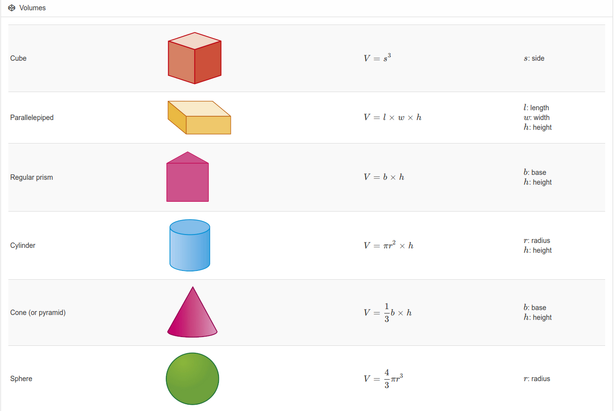

# Volume Formulas

## Cube

 $$V = a3$$ **\(in which a is one of the edges\)**

## Rectangular prism

$$V = abc$$ **\(in which a is the length, b is the width, and c the depth\)**

## Pyramid

$$V = (Ah)/3$$ **\(in which A is the area of the base and h the height\)**

## Cylinder

$$V = πr2h$$ **\(in which π is 3.1416, r the radius of the base, and h the height\)**

## Cone

$$V = (πr2h)/3$$ **\(in which π is 3.1416, r theradius of the base, and h the height\)**

## Sphere

$$V = (4πr3)/3$$ **\(in which π is 3.1416 and r the radius\)**

